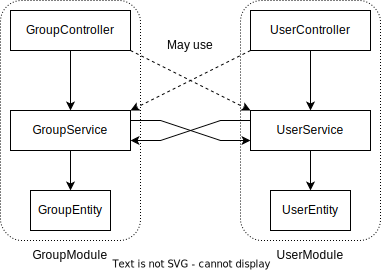

# Styleguide

This file describes the styleguide applied to the [backend](../README.md) application.

> It is an extension of the `common` [styleguide](../../../libs/common/docs/styleguide.md).

## Table of contents

<!-- TOC -->
* [Styleguide](#styleguide)
  * [The `/app` folder](#the-app-folder)
  * [Relations](#relations)
  * [Mikro-orm](#mikro-orm)
    * [Mikro-orm migrations](#mikro-orm-migrations)
<!-- TOC -->

## The `/app` folder

This folder contains the business logic of the application.
It mainly consists of entities, controllers and services.

## Relations

The relations between the components are straight forward:  
The services are the trust source of the entities,
and they are the only components that can be used in another modules.

## Mikro-orm

### Mikro-orm migrations

When creating a migration,
the migration class must be listed in this [file](../src/orm/migrations/index.ts).
So the migrations are integrated in the compiled code.

The [snapshot](../src/orm/migrations/snapshot.json) must not be manually modified,
expect with `ESLint`.

> This file helps to make the difference between the current DB schema and the last.
