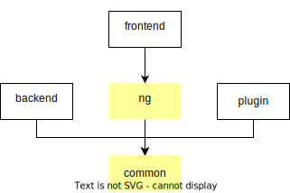

# Development flow

This file describes how one should develop in this project.

> To know about more this project, go [here](../README.md).

This file is more about how to develop, what part does what, rather than a real "flow" process.

## Table of contents

<!-- TOC -->
* [Development flow](#development-flow)
  * [Technologies](#technologies)
    * [Other technologies](#other-technologies)
  * [Structure](#structure)
    * [Libraries](#libraries)
      * [`common` library](#common-library)
      * [`ng` library](#ng-library)
      * [Plugin library](#plugin-library)
    * [Applications](#applications)
      * [Backend application](#backend-application)
      * [Frontend application](#frontend-application)
      * [Office application](#office-application)
  * [Philosophies](#philosophies)
  * [Dev process](#dev-process)
    * [Defining the data transmitted](#defining-the-data-transmitted)
    * [Defining how the data is transmitted](#defining-how-the-data-is-transmitted)
    * [Write tests](#write-tests)
      * [How to write (unit) tests](#how-to-write-unit-tests)
    * [Implement the feature](#implement-the-feature)
<!-- TOC -->

## Technologies

Here's a list of the main technologies of this project:

* `Nx` <https://nx.dev/>: Manage the code
* `NestJS` <https://nestjs.com/> (usually just called `Nest`):  Main framework for the _backend_.
* `Angular` <https://angular.io/>: Main framework for the _frontend_s.

### Other technologies

Some other technologies, also utilised a lot:

* `class-transformer` <https://www.npmjs.com/package/class-transformer>: Transform un-serialized data
* `class-validator` <https://www.npmjs.com/package/class-validator>: Validate structure of data.
* `mikro-orm` <https://www.npmjs.com/package/mikro-orm>: Use to manage the database.
* `rxjs` <https://www.npmjs.com/package/rxjs>: Really well integrated in `Angular` and `Nest`.

> All installed packages can be seen in the [package.json](../package.json) file.

## Structure

WIth `Nx`, there's code that is shared between the different sections of the project.

The hierarchy can be shown as:



### Libraries

The `Nx` librairies are used to share code between the application and
these have their own purpose.

#### `common` library

This is the main library containing the code shared between all application and others library.

It contains mainly the data structure read and wrote by the `backend` and the _frontends_.

> More about this library can be seen [here](../libs/common/README.md).

#### `ng` library

An extension of the `common` library, that concentrates on the _frontends_ shared code.

> More about this library can be seen [here](../libs/ng/README.md).

#### Plugin library

The `plugin` "library" is not really a library.
It is a plugin of this project that helps by generating code.

> More about this library can be seen [here](../libs/plugin/README.md).

### Applications

The applications are the final products of the project

#### Backend application

It is the application with an API REST.  
That is the application that manages the final business logic and non-volatil data.

> More about this application can be seen [here](../apps/backend/README.md).

#### Frontend application

The application, as can be understood by the final users,
communicates with the `backend` and is the product.

> More about this application can be seen [here](../apps/frontend/README.md).

#### Office application

Very similar to the `frontend` application, it is used by fewer users,
that are mostly aware of the data.
The application helps to manage the data of the `backend`.

> More about this application can be seen [here](../apps/office/README.md).

## Philosophies

Not much to write, except that the chosen approach focuses on the transmitted data
and not the processed one.  
That means the data transmitted through a HTTP request, a socket canal, ... is the main focus.

Another philosophy is to follow TDD (**T**est **D**riven **D**evelopment)
(and even BDD (**B**ehavior-**d**riven **d**evelopment)).  
That mean to use tests to code the features, rather than running the whole application.

## Dev process

When a new feature is requested, it will follow the same logic.

> The following sections use an example of a completely new feature.
> Depending on the case, the process can automatically start at the [write tests](#write-tests) part.

### Defining the data transmitted

It corresponds to the following questions:

* What is the data to read in the `frontend`?
* What will be sent to the `backend`?

This should help define the DTOs for basic CRUD operations:

* **C**reate
* **R**ead
* **U**pdate
* **D**elete

**Example:**  
Need to add groups to the current application.

```typescript
// group.dto.ts
class GroupDTO {}
// group.create.dto.ts
class GroupCreateDto {}
// ...
```

### Defining how the data is transmitted

Once the DTOs defined, set the "channel" in which they will communicate.

Most of the time, it will simply be by HTTP via the REST API.  
The entrypoint must be defined and its methods.

```typescript
// group.entrypoint.ts
const GROUP_ENTRYPOINT = "/api/groups"
interface GroupEndpoint {
    findOne(id: number): Promise<GroupDTO>;
    create(body: GroupCreateDTO): <GroupDTO>;
}
```

Then the section in both the `backend` and the shared `ng` can be created
(but no need to implement yet):

```typescript
// /backend/group.controller.ts

@Controller(GROUP_ENTRYPOINT)
class GroupController implements GroupEndpoint {
    public findOne(id: number): Promise<GroupDTO> {
        throw new Error("Not implemented yet")
    }
    public create(body: GroupCreateDTO): Promise<GroupDTO> {
        throw new Error("Not implemented yet")
    }
}

// /backend/group-api.service.ts
class GroupApiService implements GroupEndpoint {
    public findOne(id: number): Promise<GroupDTO> {
        // http.get(GROUP_ENTRYPOINT);
        throw new Error("Not implemented yet")
    }
    public create(body: GroupCreateDTO): Promise<GroupDTO> {
        throw new Error("Not implemented yet")
    }
}
```

### Write tests

At this point, BDD and TDD appears.
The optimal would be to write [e2e tests](./flow-testing.md#e2e-testing).

And then to start slowly to implement the feature, by writing tests.
As mentioned, the purpose of this is to validate the feature against the tests
and not the whole application.

#### How to write (unit) tests

Of course, the tests will not be written with unknown definition.
This processus is also very similar to the [one](#dev-process) of this file.

For example, if a function must be developed:

1. Write function definition(s), that consists:
   * Name
   * Parameters
   * Outputs
   * Comments
2. Write the tests
3. Write the function body ([Implement the feature](#implement-the-feature))

```typescript
// 1.
declare class DivideByZeroError extends Error {}
export interface Parameter { a: number, b: number }
/** ... */
export function divide(parameter: Paramter): number {
    throw new Error("Not implemented yet")
}

// 2.
describe("`divide` function", () => {
    it("Should be ok", () => {
        expect(divide({ a: 6, b: 2 })).toBe(3)
    });
    it("Should be ko", () => {
        expect(() => divide({ a: 6, b: 0 })).toThrow(DivideByZeroError);
    });
});
```

### Implement the feature

Now that the tests are defined and conformed to the specification,
the feature can be developed with the `watch mode` for instance.

> Of course the given examples are idyllic.
> Most of the time tests are added or changed while a feature is developed,
> because an error occurred or a new problem was found.
>
> However, it follows the philosophy by alternating between
> [Write tests](#write-tests) and [Implement the feature](#implement-the-feature).
