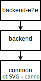
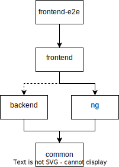

# Testing

This file describes what are the tests purpose and what they test.

> Testing is very much part of the [development process](./flow-dev.md#dev-process).

## Table of contents

<!-- TOC -->
* [Testing](#testing)
  * [Unit and integration tests](#unit-and-integration-tests)
  * [E2E testing](#e2e-testing)
    * [E2E Backend](#e2e-backend)
    * [E2E Frontend](#e2e-frontend)
  * [Post-development](#post-development)
<!-- TOC -->

## Unit and integration tests

These kind of tests represent the specifications.
They ensure the code functionality.

It is not mandatory to add tests to everything (but encouraged).
For example, classes for typing, such as the DTOs, do not necessary need tests.

## E2E testing

E2E (**E**nd **2** **E**nd) consists of testing a whole running application.
It confirms that the final use of that application is correct.

More specifically, their objective is to detect regression bugs.

### E2E Backend

The E2E testing of the `backend` confirms that the API is correctly implemented.
The results are well formatted and the input validation works.

The code is available [here](../apps/backend-e2e).  
It also tests its parent shared code:

> The commands can be seen [here](../apps/backend-e2e/docs/commands.md).

### E2E Frontend

The E2E testing of the `frontend` confirms that the main application,
available to the users, is working as expected.

The code is available [here](../apps/frontend-e2e).  
It tests its parent shared code and indirectly the `backend`:

> The commands can be seen [here](../apps/frontend-e2e/docs/commands.md).

## Post-development

At some point, the code will be used in production.
Some errors could be returned by any log system ou final users.

Instead of just reporting the issue, tests (at least one in one of the E2E) should be created.  
The person reporting this issue has no obligation of fixing it;

It could simply be someone who has no technological knowledge and
uses the _studio mode_ to add the test(s).

> The person, that is no developer, adding e2e tests does not need to "clean" the code.
> It's the person fixing the issue that assure that the [styleguide](./styleguide.md) is still applied.
>
> The tests should be created in a new git branch starting with `fix/`.  
> See [here](./flow-git.md#fix-branches).

Then the same people or another can investigate and
add more tests, then anyone can fix it.

> It corresponds to the [dev flow](./flow-dev.md#write-tests).
