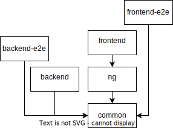

# Styleguide

This file describes the styleguide applied to the project.

> To know how to contribute, go [here](./flow-git.md).

## Table of contents

<!-- TOC -->
* [Styleguide](#styleguide)
  * [Compliance](#compliance)
  * [Eslint](#eslint)
  * [Global](#global)
    * [Ordering](#ordering)
      * [Class member ordering](#class-member-ordering)
    * [_Non-private_ accessors naming](#non-private-accessors-naming)
      * [What are _non-private_ accessors?](#what-are-non-private-accessors)
      * [Why this order?](#why-this-order)
    * [Prioritize usage over (code) reading (and comprehension)](#prioritize-usage-over-code-reading-and-comprehension)
    * [Comments](#comments)
  * [Specific categories or files](#specific-categories-or-files)
    * [Documentation](#documentation)
    * [Typescript](#typescript)
      * [Testing](#testing)
    * [Docker](#docker)
      * [Docker-compose](#docker-compose)
  * [Specific applications](#specific-applications)
    * [Hierarchy](#hierarchy)
<!-- TOC -->

## Compliance

The project conforms to the style guide if all the rules described therein are respected.
The same applies to the styleguide extensions of the applications.

if, for a given code format, there is no rule in the styleguide, it is either :

1. Not restricted
2. Missing in the styleguide, in which case the styleguide must be updated.

## Eslint

A lot of rules are already defined with _eslint_.
They are considered as part of the styleguide.

The following sections are rules that it cannot enforce (yet).

## Global

The following sections are applied to any file of the project.

### Ordering

The ordering helps to highlight or to search code.
It also avoids conflicts with _git_.

The ordering is applied to almost all files (_typescript_, _json_, _scss_, ...).

> Always prefer the alphabetical order if none other order takes place.

#### Class member ordering

The ordering of the members of a class is not forced.
However, it is still recommended to order them.

```typescript
class MyClass {
  public getA() { /*...*/ }
  public getB() { /*...*/ }
}
```

### _Non-private_ accessors naming

When naming _non-private_ accessors, use the name,
or _main domain_ first, then the complement.

> **What is a _"domain name_"?**  
> It's the name of dependant code managing an entity (~= domain).
>
> **Examples**:  
> Given the _domain_ "user", the following names are correct:
>
> * UserController
> * UserModule
> * UserService

#### What are _non-private_ accessors?  

Exported variables, methods or function
that can be accessed from another part of the code.

**Examples**:

 ```typescript
// non-private
export const BACKEND_URL = "...";

// private
const config = {};

export class UserHelper {
  // non-private
  public getPublic() { /*...*/ }
  protected getProtected() { /*...*/ }

  // private
  private getPrivate() { /*...*/ }
}
 ```

#### Why this order?

It is easier to describe a location by its largest parent
and then sharpened its precision.

**Real life example**:  
Where is _Bern_? - World -> Europe -> Central -> Switzerland

**Code example**:  
Given a button with a left and right icon.

```typescript
// "bad" naming
interface ButtonOptions {
  // ... others properties
  leftIcon: unknown;
  // ... others properties
  rightIcon: unknown;
  // ... others properties
}
```

With the order applied, the similar options are close to each order (and ordered):

```typescript
// "good" naming
interface ButtonOptions {
  // ... others properties
  iconLeft: unknown;
  iconRight: unknown;
  // ... others properties
}
```

> **Note**:  
> Remember that this applies to _"non-private"_ accessors.
> "Good" english can still be used to create internal variables.
>
> ```typescript
> function DoButton(options: ButtonOptions) {
>  const leftIcon = options.iconLeft;
>  // ...
> }
> ```

### Prioritize usage over (code) reading (and comprehension)

The following sentence is read/heard many times:

> A code is written once but read many times.

It's mainly true, however this implies that to understand a function,
its implementation should be read.
And it's not what this section is about.

From this styleguide, a function implementation is let to be pretty freely developed.
For instance, control loops (`for`, `while`, ...) can be used
and a more functional approach is still encouraged (`map`, `filter`, ...).

> **Note**:  
> This does not mean that an implementation can be encrypted or unreadable :).

On the other hand, the name of a function must be explicit, otherwise accompanied by comments.  
Modern IDEs integrate pretty well any `JSDoc`.  
In case of ambiguity,
examples (`@example`) provide chunks of code showing how to use or not to use a function.

### Comments

As read in the previous section, commenting the code is highly encouraged.

It should be used, with the `JSDoc`, to explain some lines,
explain why some decision have been made,
summary optimized instructions, ... .

#### Comments on dependency injection constructor

`Angular` and `NestJS` use dependency injection.  
So the comments in the constructor are not very important.

They can simply set to one of the following:

```typescript
@Injectable()
class MyInjectable1 {
  /**
   * Constructor with "dependency injection"
   * 
   * @param service injected
   */
  public constructor(private readonly service: MyService) {}
}

@Injectable()
class MyInjectable2 {
  /** @internal */
  public constructor(private readonly service: MyService) {}
}
```

## Specific categories or files

### Documentation

See [here](./styleguide/documentation.md) to know how to write _Markdown_ documentation files.

### Typescript

See [here](./styleguide/typescript.md) to know how to write _Typescript_ files.

#### Testing

Do not forget the [testing](./styleguide/typescript.md#test-files) section.

### Docker

All about Docker related files.

#### Docker-compose

Do **not** prefix the services in a `docker-compose.yml` file.
They are already prefixed by the folder it is run from.

## Specific applications

Check the following files for their specific styleguide.

* Shared
  * `common`: see [styleguide](../libs/common/docs/styleguide.md).
  * `ng`: see [styleguide](../libs/ng/docs/styleguide.md).
  * `plugin`: see [styleguide](../libs/plugin/docs/styleguide.md).
* Application
  * `backend`: see [styleguide](../apps/backend/docs/styleguide.md).
  * `frontend`: see [styleguide](../apps/frontend/docs/styleguide.md).

### Hierarchy

Brief summary of the styleguide hierarchy:

> 
