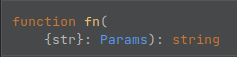
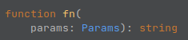

# Typescript

_Typescript_ is the main language of the project.
It is important to have a consistent code within the project.

> This file is an extension of the global [styleguide](../styleguide.md).

The rules can also be applied to _Javascript_ files.

> _function_ and _method_ are used as synonyms and no distinction is made between them.

## Table of contents

<!-- TOC -->
* [Typescript](#typescript)
  * [`null` vs `undefined`](#null-vs-undefined)
    * [When to use `null` or `undefined`?](#when-to-use-null-or-undefined)
      * [`null` vs `undefined` examples](#null-vs-undefined-examples)
  * [When to export `interface`s or `type`s?](#when-to-export-interfaces-or-types)
    * [Attached types](#attached-types)
  * [Destructuring](#destructuring)
    * [Example with destructured parameter](#example-with-destructured-parameter)
    * [Example with non-destructured parameter](#example-with-non-destructured-parameter)
  * [The `readonly` keyword](#the-readonly-keyword)
  * [The internal library](#the-internal-library)
  * [Package-like accessor](#package-like-accessor)
  * [Barrel files (index.ts)](#barrel-files-indexts)
    * [When to use the barrel files?](#when-to-use-the-barrel-files)
  * [Test files](#test-files)
    * [Comments](#comments)
    * [Mocking](#mocking)
      * [Deterministic values](#deterministic-values)
<!-- TOC -->

## `null` vs `undefined`

`null` and `undefined` are often mixed, but they do not represent the same thing.

It can be summarized as follows:

* `undefined`: There can be no value or the value is `undefined`
* `null`: There is a value and this value is `null`.

### When to use `null` or `undefined`?

Use `undefined` to:

* determine if a value exists
* set a variable that is not loaded, but the value could be null

Otherwise, use `null`.

#### `null` vs `undefined` examples

Determine an existing key:

```typescript
const struct: { nested?: { prop?: string | null; } } = {/*...*/};

console.log(struct.nested?.prop)
// `undefined`, `string` or `null`
// `undefined` could be returned due to the optinnal `nested` or `prop`

console.log(!!struct.nested?.prop)
// If false, prop can still be `undefined` or `null`
console.log(struct.nested?.prop !== undefined)
// `prop` is defined with `null` or `string`
```

---

Uninitialized variable:

```typescript
// `null` when error;
type Response = null | number;
declare function call(): Response;

let response: undefined | Response
function singletonCall(): Response {
    if (response === undefined) {
        response = call();
    }
  
    return response;
}
```

## When to export `interface`s or `type`s?

Always export them if they are directly used in the parameters or return type
of any _non-private_ functions or constants.

**Example:**

```typescript
interface OutputPrivate {
    str: string;
}
export interface OutputPublic extends OutputPrivate {
    number: number;
}

export class MyClass {
    public doA(param: number): OutputPublic {
        return {
            ...this._doA(param.toString(2)),
            number: param
        };
    }
    private _doA(param: string): OutputPrivate {
        return { str: param };
    }
}
```

> It is also recommended to export a `type` that is only an alias for a function parameter or return,
> if this type could be extended.
>
> **Example:**
>
> ```typescript
> interface FnAParams {
>     // ...
> } 
> declare function fnA(params: FnAParams): number; 
> 
> type FnBParams = FnAParams;
> function fnB(params: FnBParams): number {
>     return fnA(params);
> }
> ```
>
> **Becomes:**
>
> ```typescript
> interface FnBParams extends FnAParams {
>     factor?: number
> }
> function fnB(params: FnBParams): number {
>     const {factor = 1, ...paramsA} = params;
>     return factor * fnA(paramsA);
> }
> ```

### Attached types

Any `type` or `interface` should be defined close to its use.
That means that it can be exported directly in the same file or another
if it is on many files on the same directory.

Example, on a same directory:

* `user.controller.ts`
* `user.interface.ts`
* `user.service.ts`

Another example (discouraged):

* `user/`
  * `controller.ts`
  * `types.ts`
  * `service.ts`

---

**However**, they should not be defined on specific directories only used for types:

* `group/`
* `user/`
* `types/`
  * `group.ts`
  * `user.ts`

Unless they are very global and detached types for the project.

## Destructuring

Do **not** destructure object parameters of _non-private_ functions.

The IDEs (at least _WebStorm_), show the parameters destructured.
It is preferred to keep a function definition as normalized as possible.

### Example with destructured parameter

With the following code:

```typescript
export interface Params {
    str: string;
}
export function fn({ str }: Params) {
    // ...
    return str;
}
```

The IDE pop-up looks like:



### Example with non-destructured parameter

With the following code:

```typescript
export interface Params {
    str: string;
}
export function fn(params: Params) {
    const { str } = params;
    // ...
    return str;
}
```

The IDE pop-up looks like:



## The `readonly` keyword

Do not forget to use this keyword, for both readonly arrays and class properties.
With dependency injection, a lot of properties will never be modified:

```typescript
declare class UserService {
}

class GroupService {
    private readonly connection: unknown;
    public constructor(private readonly userService: UserService) {
    }
  
    public findByIds(ids: readonly number[]) {
        // ...
    }
}
```

## The internal library

When having common code for a same category, use a `_lib` folder to store it.
The content of this folder should not really be usable or shown as it is.

* Abstract classes
* Functions that should not be used elsewhere
* Constants

**Example:**

```typescript
// /dtos/_lib/base.dto.ts
abstract class BaseDto {}

// /dtos/group.dto.ts
class GroupDto extends BaseDto {}
```

It avoids having too many files in the same directory.

> **Why the `_` in `_lib`?**  
> It is to separate this folder from the others.
> And most IDEs sort the folders by alphabetical order, so it will the first one shown.

## Package-like accessor

Typescript does not have a package level as `Java` does.
To simulate this level, `_` is placed as the first character of a function.

Example:

```typescript
class GroupService {
  /**
   * Check things.
   * 
   * Used by UserService.
   */
  public _checkGroupForUser() { /*...*/ }
}

class UserService {
  private readonly groupService!: GroupService;
  
  public validate() {
    this.groupService._checkGroupForUser();
  }
}
```

These functions must have a comment in which it lists the classes using this function.

## Barrel files (index.ts)

Do not overuse barrel files, especially in application code:  
There will probably be a lot of bidirectional relation in them.

> **Example:**
>
> With the given code, with dependency injection,
> a barrel file would probably load dependent code of each domain
>
> ```typescript
> // /group/group.service.ts
> class GroupService {
>     // ForwardRef()
>     public constructor(private readonly userService: UserService) {}
>     public getUsersForGroup() {}
> }
> 
> // /user/user.service.ts
> class UserService {
>     public constructor(private readonly groupService: GroupService) {}
>     public getGroupsForUser() {}
> }
> ```

### When to use the barrel files?

They can be used to export files from the same folder, or a sub-folder, if it makes sense.
Never export from parent directories.

How an import would look like determines if it makes sense.

**Example:**

```typescript
// /dtos/index.ts
export * from "./_lib/class-base.dto"; // optionnal
export * from "./class-a.dto";
export * from "./class-b.dto";

// /other.file.ts
import { classADto, classBaseDto, classBDto } from "./dtos"
// ...
```

## Test files

There is no real rules for test files.
Except to keep the code readable, event if that means that the code is not optimized or duplicated.

A file in which what it is tested is easily understandable is better
than an optimized code that runs 5 times faster.

> Also see [testing flow](../flow-testing.md) to understand how the test flow works.

### Comments

Do not forget comments in the testing files.

The description of the tests is sometimes enough:

```typescript
it("Should return 2", () => {
  expect(fn()).toBe(2);
})
```

But for more complex tests, comments are required to determine
what is the purpose of the test.

### Mocking

**Do not over-mock!!**

Avoid mocking too much code.  
If so, the real code is no longer tested, but only the mock implementation is.

A special `docker` container is run alongside the tests for any DB access.

#### Deterministic values

When testing, use values manually set.  
It provides deterministic values to really determine the outcome of an operation.

Only use a lot of generated data for benchmarking.
